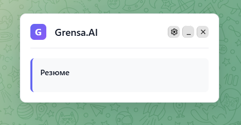
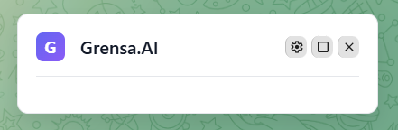
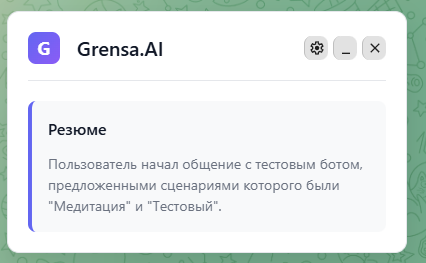
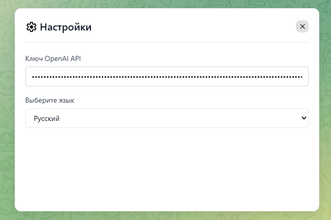

## Выполненные задачи

### Основные задачи (обязательные)

- [x] Парсинг чата и генерация резюме через OpenAI API
- [x] Отображение резюме в окне расширения
- [x] Автоматическое обновление при смене чата

### Дополнительные задачи (по выбору)

- [x] Перетаскиваемое окно расширения
- [x] Кнопки скрытия/показа расширения

## Инструкции по тестированию

1. Соберите расширение: `yarn build`
2. Загрузите в Chrome из папки `build/`
3. Откройте https://web.telegram.org
4. В окне расширения кликните по кнопке настроек, и введите ключ от OpenAI API

## Опционально - Скриншоты/Демо

  
  
  

## Опционально - Известные проблемы
